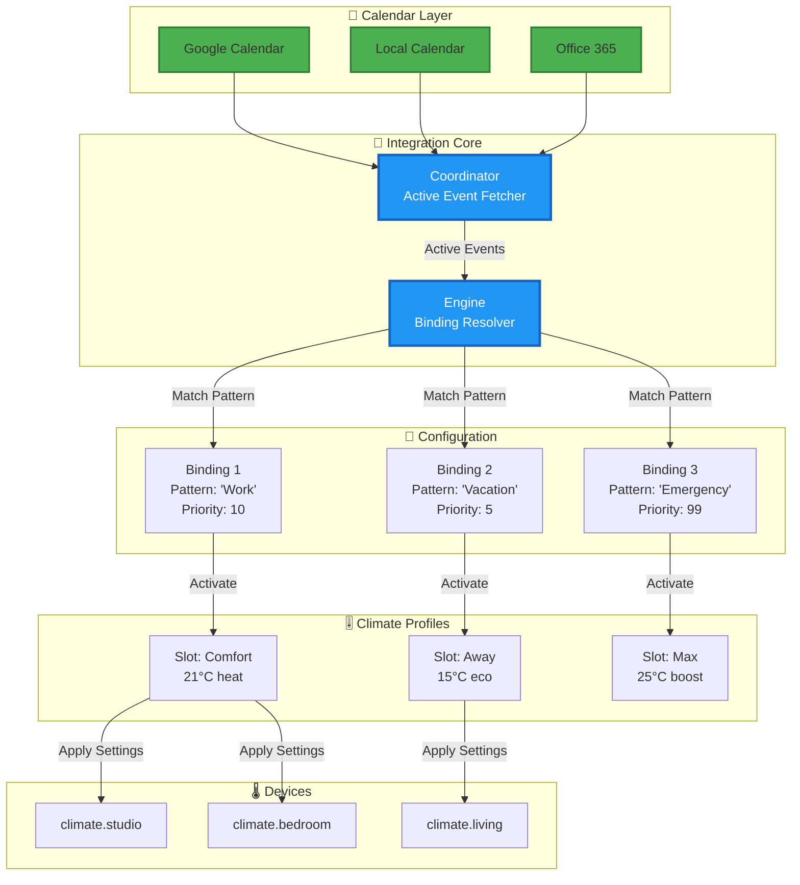

# 🏗️ Climate Control Calendar - Architecture Overview

**Transform any Home Assistant calendar into intelligent climate control**

---

## 🎯 The Big Picture

Climate Control Calendar replaces rigid, time-based heating schedules with **flexible, event-driven climate management**. Your lifestyle changes daily—your heating should too.


---

## 🧩 Core Components

### 1. 📅 **Calendars** - Your Lifestyle as Events

**Any Home Assistant calendar becomes a control source.**

Instead of programming "Monday 9-18 → 21°C", you create calendar events:
- **"Smart Working"** (every workday)
- **"Vacation Mode"** (summer weeks)
- **"Emergency Override"** (ad-hoc event created in 10 seconds)

**Why it's powerful:**
- ✅ Manage schedules in your favorite calendar app (Google Calendar, Outlook, etc.)
- ✅ Recurring events, exceptions, and one-off events all work seamlessly
- ✅ Share calendars with family members
- ✅ Modify on-the-go from your phone
- ✅ Multiple calendars for different zones/purposes

**Example:**
```
Google Calendar → Home Assistant → Climate Control
└─ "WFH Morning" (every Tue/Thu 8-12) → binding matches → applies "Comfort" slot
```

---

### 2. 🔗 **Bindings** - The Smart Pattern Matcher

**Bindings connect calendar events to climate configurations using pattern matching.**

When a calendar event becomes active, bindings check if it matches their patterns.

#### Binding Anatomy:

```yaml
Binding:
  📋 ID: unique_binding_123
  📅 Calendars: calendar.work (or "*" for all)
  🔍 Match Pattern:
      Type: summary_contains
      Value: "Smart Working"
  🎯 Target Slot: slot_comfort_id
  🏠 Target Entities: [climate.studio, climate.bedroom] (optional)
  ⚡ Priority: 10 (higher wins conflicts)
```

#### Pattern Types:

| Type | Description | Example |
|------|-------------|---------|
| `summary` | Exact match | Event "Morning" matches pattern "Morning" |
| `summary_contains` | Partial match | Event "WFH Morning" matches pattern "Morning" |
| `regex` | Regex pattern | Event "smart_work_2024" matches `smart.*` |

#### Priority System:

When **multiple events are active** simultaneously, priority determines which wins:

```
Active Events:
  📅 Event A: "Smart Working" → Binding (priority 5) → Slot 1
  📅 Event B: "Emergency Heat" → Binding (priority 20) → Slot 2
  📅 Event C: "Night Mode" → Binding (priority 3) → Slot 3

Result:
  🏆 Event B wins (priority 20) → Applies Slot 2 to entities
```

#### Multi-Calendar Support:

```
Calendar 1 (Work): "Office Day" → Binding 1 → Slot "Eco"
Calendar 2 (Personal): "Home Renovation" → Binding 2 → Slot "Off"
Calendar 3 (Kids): "School Holiday" → Binding 3 → Slot "Comfort"

All monitored simultaneously, priorities resolve conflicts
```

---

### 3. 🎚️ **Slots** - Climate Configuration Templates

**Slots are reusable climate setting templates.**

Think of slots as "climate profiles" that bindings activate.

#### Slot Anatomy:

```yaml
Slot:
  🆔 ID: slot_comfort_123
  🏷️ Label: "Comfort Mode"
  🌡️ Default Payload:
      # Temperature settings (choose one approach)
      temperature: 21              # Single temperature target
      # OR for heat_cool mode:
      target_temp_high: 25         # Maximum temperature
      target_temp_low: 22          # Minimum temperature

      # HVAC control
      hvac_mode: heat              # heat, cool, heat_cool, auto, off, fan_only, dry
      preset_mode: comfort         # away, home, eco, boost, comfort, etc.

      # Advanced climate control
      humidity: 60                 # Target humidity (0-100%)
      aux_heat: true               # Auxiliary/backup heat (for heat pumps)
      fan_mode: auto               # auto, low, medium, high, off
      swing_mode: both             # off, vertical, horizontal, both

  🏠 Entity Overrides:
      climate.bedroom:
        temperature: 22            # Bedroom warmer
      climate.bathroom:
        temperature: 19            # Bathroom cooler
        humidity: 55               # Lower humidity in bathroom

  🚫 Excluded Entities:
      - climate.garage             # Never control garage
```

#### Why Reusable?

Multiple bindings can activate the same slot:

```
Binding 1: "Morning Work" → Slot "Comfort"
Binding 2: "Afternoon Work" → Slot "Comfort"
Binding 3: "Weekend Active" → Slot "Comfort"

All use same climate settings, no duplication!
```

#### Entity-Specific Overrides:

Control different rooms differently **within the same slot**:

```
Event: "Smart Working" → Slot "Work Mode"
  🏠 Global Default: 21°C
  🛋️ climate.living_room: 21°C (default)
  💼 climate.studio: 23°C (override - working here!)
  🛏️ climate.bedroom: 18°C (override - not using now)
```

---

### 4. 🌡️ **Climate Entities** - The Physical Devices

**Target entities receive climate settings from activated slots.**

#### Flexible Targeting:

| Level | Where Defined | Scope |
|-------|---------------|-------|
| **Global Pool** | Integration config | All entities by default |
| **Binding Target** | Specific binding | Override for this binding only |
| **Slot Override** | Specific slot | Custom settings per entity |
| **Slot Exclusion** | Specific slot | Skip certain entities |

#### Example Flow:

```
Global Pool: [climate.studio, climate.bedroom, climate.living, climate.kitchen]

Event: "Work From Home" active
↓
Binding matches:
  Target: [climate.studio, climate.bedroom]  ← Only these 2
  Priority: 10
↓
Slot "Comfort" applied:
  climate.studio: 23°C (entity override)
  climate.bedroom: 21°C (default payload)
  climate.living: unchanged (not in binding target)
  climate.kitchen: unchanged (not in binding target)
```

---

## 🚀 Real-World Power Examples

### Example 1: **Flexible Smart Working Schedule**

**Problem:** Work-from-home days vary week to week.

**Old Way (time-based):**
```
❌ Hardcoded: Mon-Fri 9-17 → 21°C
   Problem: What about vacation? Sick days? Irregular schedules?
```

**New Way (event-based):**
```
✅ Calendar: Create "WFH" event on days you work from home
   Binding: "WFH" → Slot "Work Comfort" (23°C studio, 19°C bedroom)

   Flexibility:
   - Delete event → no heating that day
   - Add exception → heating follows
   - Recurring with exclusions → fully flexible
```

---

### Example 2: **Multi-Zone with Priorities**

**Scenario:** 3 zones, different schedules, emergency override.

```
Calendars:
  📅 calendar.zone_living: "Living Active" events
  📅 calendar.zone_sleeping: "Sleeping Zone" events
  📅 calendar.emergencies: "Emergency Heat" events

Bindings:
  🔗 Binding 1: calendar.zone_living → "Living" → Slot "Comfort" (priority 5)
     Target: [climate.living, climate.kitchen]

  🔗 Binding 2: calendar.zone_sleeping → "Sleep" → Slot "Night" (priority 5)
     Target: [climate.bedroom, climate.bathroom]

  🔗 Binding 3: calendar.emergencies → "Emergency" → Slot "Max Heat" (priority 99)
     Target: "*" (all entities)

Scenario:
  ⏰ 14:00: "Living Active" event ongoing → Living zone at 21°C
  ⏰ 22:00: "Sleep" event starts → Sleeping zone at 18°C, living continues 21°C
  ⏰ 02:00: Add "Emergency Heat" event from phone (burst pipe!)
           → ALL zones immediately switch to 25°C (priority 99 wins)
```

---

### Example 3: **Vacation + Weekly Maid Service**

**Scenario:** Away for 2 weeks, but maid comes every Tuesday morning.

```
Calendar:
  📅 "Vacation" (2 weeks, all-day event)
  📅 "Maid Service" (every Tuesday 8-11)

Bindings:
  🔗 Binding 1: "Vacation" → Slot "Away" (priority 5)
     Payload: {temperature: 15, preset_mode: away}

  🔗 Binding 2: "Maid Service" → Slot "Comfort" (priority 10)
     Payload: {temperature: 20, hvac_mode: heat}

Result:
  📅 Mon, Wed-Sun: 15°C (away mode)
  📅 Tuesday 8-11: 20°C (maid working, priority 10 wins)
  📅 Tuesday 11:01: Back to 15°C (maid event ends, vacation resumes)
```

No manual intervention needed! Calendar handles it.

---

### Example 4: **Per-Room Custom Schedules**

**Scenario:** Kids' room needs different schedule than master bedroom.

```
Slots:
  🎚️ Slot "Night Adults":
     Default: 18°C
     Overrides:
       climate.master_bedroom: 17°C (adults like cooler)

  🎚️ Slot "Night Kids":
     Default: 20°C
     Overrides:
       climate.kids_room: 21°C (kids need warmer)

Bindings:
  🔗 "Adult Sleep" → Slot "Night Adults" → Entities: [climate.master_bedroom]
  🔗 "Kids Sleep" → Slot "Night Kids" → Entities: [climate.kids_room, climate.playroom]

Calendar Events:
  📅 "Adult Bedtime" (22:00-07:00) → 17°C master
  📅 "Kids Bedtime" (20:00-07:00) → 21°C kids room, 20°C playroom
```

Different schedules, different temperatures, one integration!

---

### Example 5: **Advanced Climate Features for Modern HVAC**

**Scenario:** Heat pump with humidity control and temperature range management.

```
Slots:
  🎚️ Slot "Summer Comfort":
     Temperature Range: 22-25°C (heat_cool mode)
     Humidity: 60%
     Fan Mode: auto
     HVAC Mode: heat_cool

  🎚️ Slot "Winter Efficient":
     Temperature: 21°C
     HVAC Mode: heat
     Auxiliary Heat: ON (backup heat for cold days)
     Fan Mode: low

  🎚️ Slot "Dehumidify":
     HVAC Mode: dry
     Humidity: 50%
     Fan Mode: high
     Swing Mode: both

Bindings:
  🔗 "Summer Season" → Slot "Summer Comfort" (priority 5)
  🔗 "Winter Season" → Slot "Winter Efficient" (priority 5)
  🔗 "Humidity Alert" → Slot "Dehumidify" (priority 15)

Calendar Events:
  📅 "Summer" (June 1 - Sep 30, all-day)
  📅 "Winter" (Nov 1 - Mar 31, all-day)
  📅 "High Humidity Day" (created manually when needed)

Result:
  🌞 Summer: Maintains temperature between 22-25°C with humidity at 60%
  ❄️ Winter: Fixed 21°C with auxiliary heat for efficient heat pump operation
  💧 Humid Days: Dehumidify mode overrides seasonal settings (priority 15)
```

**Why this works:**
- Temperature range prevents constant on/off cycling in heat_cool mode
- Humidity control maintains comfort and prevents mold
- Auxiliary heat improves efficiency on very cold days
- Priority system allows weather-based overrides

---

## 🔄 Event-Driven Architecture Benefits

### ✅ Change Detection

The system **only applies climate changes when events start or end**, not every 60 seconds.

```
Old Way:
  ⏱️ 10:00:00 - Apply 21°C
  ⏱️ 10:01:00 - Apply 21°C (redundant!)
  ⏱️ 10:02:00 - Apply 21°C (redundant!)

New Way:
  ⏱️ 10:00:00 - Event starts → Apply 21°C ✅
  ⏱️ 10:01:00 - No change → Nothing
  ⏱️ 10:02:00 - No change → Nothing
  ⏱️ 12:00:00 - Event ends → Apply new settings ✅
```

**Benefits:**
- 🚀 Reduced entity state updates
- 🔋 Less system load
- 📊 Cleaner logbook/history
- 🔔 One notification per change (not spam)

---

### ✅ Active Event Fetching

The coordinator **actively fetches events** every 60 seconds using `calendar.get_events` service.

```
Old Way:
  Wait for HA to update calendar entity state → might be delayed

New Way:
  Every 60s: Fetch events from -1h to +24h → immediate detection
```

**Benefits:**
- ⚡ New events detected within 60 seconds
- 🔄 No need to restart integration
- 📱 Create event on phone → active in 1 minute
- 🎯 Reliable even with slow calendar syncs

---

### ✅ Multi-Event Simultaneous Handling

Multiple events can be active **at the same time** with smart conflict resolution.

```
Scenario:
  📅 Event A: "Base Heating" (priority 5) → all entities
  📅 Event B: "Studio Work" (priority 10) → climate.studio
  📅 Event C: "Guest Room" (priority 7) → climate.guest

Resolution:
  🏠 climate.living: Event A (priority 5, no conflict)
  🏠 climate.studio: Event B (priority 10, wins over A)
  🏠 climate.guest: Event C (priority 7, no conflict)
  🏠 climate.bedroom: Event A (priority 5, no conflict)
```

Each entity gets the highest-priority binding targeting it!

---

## 🎨 Visual Architecture



---

## 📊 Comparison: Old vs New

| Aspect | Time-Based (Old) | Event-Based (New) |
|--------|------------------|-------------------|
| **Schedule Changes** | Edit code/config | Create calendar event |
| **Exceptions** | Complex logic | Delete/move event |
| **Mobile Management** | ❌ Restart needed | ✅ Calendar app on phone |
| **Recurring Patterns** | Manual config | Native calendar recurrence |
| **Family Sharing** | ❌ Single admin | ✅ Shared calendar |
| **Conflicting Events** | ❌ Complex conditions | ✅ Automatic priority resolution |
| **Vacation Mode** | Disable integration | Create vacation event |
| **Emergency Override** | Manual climate adjustment | 10-second calendar event |
| **Multi-Zone** | Complex automations | Multiple bindings/calendars |

---

## 🎓 Summary: Why This Architecture?

### 🧠 **Separation of Concerns**

- **Calendars**: When things happen (your lifestyle)
- **Bindings**: What triggers what (pattern matching)
- **Slots**: How to configure climate (reusable profiles)
- **Priorities**: Who wins conflicts (explicit rules)

### 🔧 **Flexibility**

- Change schedules without restarting HA
- Mix recurring, one-off, and exceptional events
- Override anything with higher-priority events
- Control entities globally or per-binding

### 🚀 **Power**

- Multiple calendars for different purposes
- Complex scenarios with simple configuration
- Real-time responsiveness to calendar changes
- Family-friendly (everyone uses calendar apps)

### 💡 **Simplicity**

- Non-technical users manage via calendar
- Technical users configure bindings once
- Pattern matching instead of complex conditions
- Priority system handles conflicts automatically

---

## 📚 Next Steps

- **[README.md](README.md)**: Installation and quick start
- **[Examples Documentation](docs/)**: Detailed configuration examples
- **[GitHub Discussions](https://github.com/max433/climate_control_calendar/discussions)**: Ask questions and share setups

---

**Built with ❤️ for smart home enthusiasts who want flexibility without complexity.**
