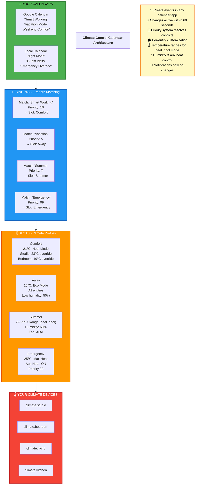

# Climate Control Calendar

## Control your home heating with any calendar app

---



---

## How It Works

1. **📅 Create Calendar Events** - Use Google Calendar, Outlook, or any HA calendar
2. **🔗 Bindings Match Patterns** - "Smart Working" event → activates "Comfort" slot
3. **🎚️ Slots Apply Settings** - 21°C with per-room overrides
4. **🌡️ Devices Updated** - Only when events start/end (no spam!)

---

## Real Example

```yaml
Calendar Event: "Work From Home" (Tue/Thu 9-17)
    ↓
Binding Matches: "Work" pattern
    ↓
Activates Slot: "Comfort Mode"
    ↓
Applies:
  🏠 climate.studio: 23°C (working here!)
  🏠 climate.bedroom: 19°C (not using)
  🏠 climate.living: 21°C (default)
```

**Emergency override?** Create "Emergency Heat" event → priority 99 → instant activation!

---

## Advanced Example: Heat Pump with Humidity Control

```yaml
Calendar Event: "Summer Comfort" (Jun-Sep)
    ↓
Binding Matches: "Summer" pattern
    ↓
Activates Slot: "Summer Mode"
    ↓
Applies:
  🌡️ Temperature Range: 22-25°C (heat_cool mode)
  💧 Humidity: 60% (prevents mold)
  🌬️ Fan Mode: Auto
  🏠 All climate entities controlled
```

**Why temperature range?** Prevents constant on/off cycling, saves energy!

---

## Why Event-Based > Time-Based?

| Feature | Time-Based ⏰ | Event-Based 📅 |
|---------|--------------|----------------|
| Change schedule | Edit config + restart | Move calendar event |
| Vacation mode | Disable automation | Create "Vacation" event |
| Family control | ❌ Tech-only | ✅ Everyone uses calendar |
| Exceptions | Complex conditions | Delete/modify event |
| Mobile access | ❌ | ✅ Calendar app |

---

## Get Started

🔗 **GitHub**: [max433/climate_control_calendar](https://github.com/max433/climate_control_calendar)

📦 **HACS**: Search "Climate Control Calendar"

📚 **Docs**: Full architecture guide in repo

---

**Transform your heating schedule from rigid code to flexible calendar events!**

*Built for Home Assistant • Open Source • MIT License*
